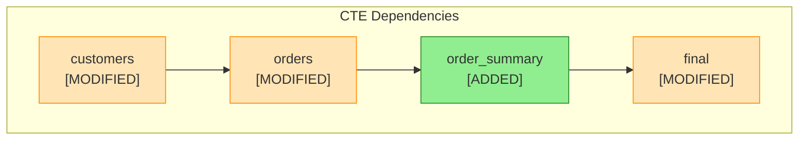
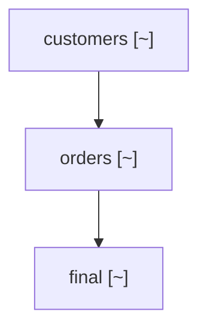

# Semantic SQL Change Tracking: Beyond Text Diffs

*How to understand what actually changed in your SQL, not just which lines moved*

---

## The Problem with Text Diffs

You're migrating a data platform. Maybe it's Informatica to Databricks, or Snowflake to Spark, or just a major refactoring effort. You completed the baseline migration in January. It's now March, and the source system has changed.

You run `git diff` and get this:

```diff
-    SELECT customer_id, SUM(amount) AS order_total
+    SELECT customer_id, SUM(amount * quantity) AS order_total, region_code
```

Great. Line 47 changed. But what does this *mean* for your data pipeline?

- Which downstream CTEs depend on `order_total`?
- Will they break because the expression changed?
- Where did `region_code` come from?
- Is there a new JOIN we need to add?

Text diffs tell you *what lines changed*. They don't tell you *what it means*.

## Semantic Change Tracking

What if your diff tool understood SQL? What if it could tell you:

```
CTE: customer_orders (MODIFIED)

Column Changes:
├── order_total: MODIFIED
│   └── Expression: SUM(amount) → SUM(amount * quantity)
├── region_code: ADDED
│   └── Source: dim_region.region_code (new JOIN)

Join Changes:
└── ADDED: LEFT JOIN dim_region ON customer.region_id = dim_region.id

Downstream Impact:
├── final_summary uses order_total → REVIEW REQUIRED
└── report_view uses total_spent (from order_total) → REVIEW REQUIRED
```

This is semantic SQL change tracking. Instead of parsing lines, we parse SQL.

## How It Works

The approach combines three techniques:

### 1. SQL Parsing with sqlglot

[sqlglot](https://github.com/tobymao/sqlglot) is a SQL parser that understands 20+ dialects. We use it to extract structured information:

```python
from mdde.analyzer.sql_change_tracker import SemanticAnalyzer

analyzer = SemanticAnalyzer(dialect="databricks")
analysis = analyzer.analyze(sql_text)

for cte in analysis.ctes:
    print(f"CTE: {cte.name}")
    print(f"  Columns: {[c.name for c in cte.columns]}")
    print(f"  Sources: {[s.name for s in cte.sources]}")
    print(f"  Joins: {len(cte.joins)}")
    print(f"  Filters: {len(cte.filters)}")
```

Each CTE becomes a structured object with:
- Column names and expressions
- Source tables/CTEs
- Join conditions
- WHERE/HAVING filters
- GROUP BY, ORDER BY

### 2. Structural Comparison

Once we have structured representations, we compare them:

```python
from mdde.analyzer.sql_change_tracker import CTEDiffer

differ = CTEDiffer(dialect="databricks")
result = differ.compare(old_sql, new_sql)

print(f"CTEs added: {len(result.added_ctes)}")
print(f"CTEs removed: {len(result.removed_ctes)}")
print(f"CTEs modified: {len(result.modified_ctes)}")

for diff in result.modified_ctes:
    print(f"\n{diff.cte_name}:")
    for col_change in diff.column_changes:
        print(f"  {col_change.description}")
```

The differ detects:
- **Added CTEs**: New CTEs that didn't exist
- **Removed CTEs**: CTEs that were deleted
- **Modified CTEs**: CTEs with structural changes
- **Renamed CTEs**: Different name, similar structure (via similarity matching)

### 3. Impact Analysis

The most powerful feature: tracing changes through the CTE dependency graph.

```python
from mdde.analyzer.sql_change_tracker import ColumnImpactAnalyzer

analyzer = ColumnImpactAnalyzer()
impact = analyzer.analyze(diff_result)

for imp in impact.all_impacts:
    if imp.severity.value == "breaking":
        print(f"BREAKING: {imp.cte_name}.{imp.column_name}")
        print(f"  Reason: {imp.description}")
        print(f"  Lineage: {' → '.join(imp.lineage_path)}")
```

If `customer_orders.order_total` changes, and `final_summary` references it, and `report_view` references `final_summary`, we trace the full impact chain.

## Real-World Example

Here's a complete before/after scenario:

### Before (January Baseline)

```sql
WITH customers AS (
    SELECT
        customer_id,
        customer_name,
        status
    FROM raw.customers
    WHERE active = true
),
orders AS (
    SELECT
        order_id,
        customer_id,
        order_total
    FROM raw.orders
),
final AS (
    SELECT
        c.customer_id,
        c.customer_name,
        SUM(o.order_total) AS total_spent
    FROM customers c
    LEFT JOIN orders o ON c.customer_id = o.customer_id
    GROUP BY c.customer_id, c.customer_name
)
SELECT * FROM final
```

### After (March Current)

```sql
WITH customers AS (
    SELECT
        customer_id,
        full_name,           -- renamed from customer_name
        customer_status,     -- renamed from status
        region_code          -- new column
    FROM raw.customers
    WHERE active = true
    AND region_code IS NOT NULL  -- new filter
),
orders AS (
    SELECT
        order_id,
        customer_id,
        order_total * quantity AS order_amount  -- modified expression
    FROM raw.orders
),
order_summary AS (           -- new CTE
    SELECT
        customer_id,
        COUNT(*) AS order_count,
        SUM(order_amount) AS total_amount
    FROM orders
    GROUP BY customer_id
),
debug_cte AS (               -- unused CTE (dead code)
    SELECT 1 AS dummy
),
final AS (
    SELECT
        c.customer_id,
        c.full_name,
        c.region_code,
        os.order_count,
        os.total_amount AS total_spent
    FROM customers c
    LEFT JOIN order_summary os ON c.customer_id = os.customer_id
)
SELECT * FROM final
```

### Analysis Output

```
=== SQL CHANGE REPORT ===

CTEs Added: 2
CTEs Removed: 0
CTEs Modified: 3
Columns Added: 7
Columns Removed: 4
Columns Modified: 1
Breaking Changes: 1
Unused CTEs: 1

---

CTE: customers (MODIFIED)
  Column Changes:
  - ADDED: full_name
  - ADDED: customer_status
  - ADDED: region_code
  - REMOVED: customer_name
  - REMOVED: status
  Filter Changes:
  - ADDED: region_code IS NOT NULL

CTE: orders (MODIFIED)
  Column Changes:
  - ADDED: order_amount
  - REMOVED: order_total

CTE: order_summary (ADDED)
  Columns: customer_id, order_count, total_amount

CTE: debug_cte (ADDED - UNUSED)
  Warning: Not referenced by any CTE or final query

CTE: final (MODIFIED)
  Column Changes:
  - ADDED: region_code
  - ADDED: order_count
  - ADDED: full_name
  - REMOVED: customer_name
  - MODIFIED: total_spent (expression changed)

---

BREAKING CHANGES:
- final.customer_name: Source column customers.customer_name was renamed to full_name

UNUSED CTEs:
- debug_cte: Can be safely removed
```

## Integration with Git

The tool integrates with Git to track changes over time:

```bash
# Run as Python module
python -m mdde.analyzer.sql_change_tracker \
    --repo /path/to/source \
    --baseline 2026-01-15 \
    --target HEAD \
    --output ./migration-updates

# Or with full options including branch
python -m mdde.analyzer.sql_change_tracker \
    --repo /path/to/source \
    --baseline 2026-01-15 \
    --target HEAD \
    --branch acceptance \
    --dialect databricks \
    --exclude-folder tests \
    --exclude-folder archive \
    --output ./migration-updates
```

### Unique Run Folders

Each run creates a timestamped folder to prevent overwriting previous analyses:

```
migration-updates/
├── 2026-03-23_143052_abc123_def456/   # Unique run folder
│   ├── summary.md                      # Overall summary with commit range
│   ├── status.yaml                     # Machine-readable status
│   ├── schema_silver/                  # Original folder preserved
│   │   └── replace/                    # Modified files
│   │       └── customers/
│   │           ├── summary.md
│   │           ├── changes.md          # Change checklists with TOC
│   │           ├── changes.docx        # Word export for Confluence
│   │           ├── semantic.md         # Full CTE analysis
│   │           ├── impact.md           # Impact analysis
│   │           ├── genai_prompt.md     # AI prompt for documentation
│   │           ├── status.yaml         # Git history per change
│   │           ├── original.sql
│   │           └── current.sql
│   └── ...
└── 2026-03-22_091530_xyz789_abc123/    # Previous run preserved
```

The folder name format is `{date}_{time}_{baseline_short}_{target_short}`.

Each file gets migration checklists with a table of contents:

```markdown
# Changes for customers.sql

## Table of Contents

| # | Change | Type | Lines | Cosmetic | Work Items |
|---|--------|------|-------|----------|------------|
| [001](#change_001) | REPLACE | functional | 45-52 | No | AB#12345 |
| [002](#change_002) | ADD | functional | 78-85 | No | - |
| [003](#change_003) | DELETE | cosmetic | 92-95 | Yes (formatting) | - |

**Summary:** 3 changes (2 functional, 1 cosmetic)

---

## [ ] change_001: Lines 45-52 {#change_001}

**Action:** REPLACE

**Introduced by:** abc123 - John Doe (2026-02-15) - "feat: Add region support"
**Work Items:** [AB#12345](https://dev.azure.com/org/project/_workitems/edit/12345)

### Remove this:
```sql
SELECT customer_id, customer_name
FROM raw.customers
```

### Replace with:
```sql
SELECT customer_id, full_name, region_code
FROM raw.customers
WHERE region_code IS NOT NULL
```

### Implementation Status
| Field | Value |
|-------|-------|
| Status | pending |
| Implemented By | |
| Implemented Date | |
| Change Type | |
| Comment | |
| Tags | |

### Migration Checklist
- [ ] Old code identified in target
- [ ] Code replaced in target
- [ ] Tested in development
- [ ] Reviewed
```

### CTE-Based Change Organization

Changes are organized by CTE (Common Table Expression) for semantic grouping:

```
customers/
├── changes.md              # Index linking to CTE folders
├── ctes/                   # CTE-organized changes
│   ├── 01_customers_[MODIFIED]/
│   │   ├── changes.md      # Column, join, filter changes
│   │   ├── old.sql         # CTE SQL from baseline
│   │   └── new.sql         # CTE SQL from target
│   ├── 02_orders_[MODIFIED]/
│   ├── 03_order_summary_[NEW]/
│   │   └── new.sql         # Only new SQL for new CTEs
│   └── 04__main_query_[MODIFIED]/
└── changes.docx            # Consolidated Word export
```

**Benefits:**
- **Semantic grouping**: Related changes grouped by logical unit
- **Ordered folders**: Numbered for dependency order (01, 02, 03...)
- **Status indicators**: [NEW], [MODIFIED], [DELETED] in folder name
- **Isolated SQL**: Each CTE's old/new SQL in separate files
- **Impact analysis**: Shows upstream and downstream CTE dependencies
- **Assignable**: "Review the changes in `03_order_summary_[NEW]`"
- **Git tracking**: See who modified which CTE's implementation status

Each CTE folder contains impact analysis showing:
- **Downstream Impact**: Which CTEs will be affected by changes to this CTE
- **Upstream Changes**: Which source CTEs have also changed (potential breaking changes)

### Cosmetic Change Detection

The tool automatically detects purely cosmetic changes:
- **Case changes**: `TRIM` vs `trim`, `SELECT` vs `select`
- **Whitespace**: Indentation, line breaks, spacing
- **Formatting**: SQL keyword casing, comma positioning
- **Comments**: Added or removed comments

Cosmetic changes are flagged in the index so reviewers can focus on functional changes:

```
| # | Type | Lines | Cosmetic | Commit | Status |
|---|------|-------|----------|--------|--------|
| change_001 | MOD | 45-52 | No | abc123 | ⬜ |
| change_002 | ADD | 78-85 | No | def456 | ⬜ |
| change_003 | DEL | 92-95 | Yes | - | ✅ |
```

### Work Item Extraction

Commit messages are automatically scanned for work item references:
- **Azure DevOps**: `AB#12345`, `#12345`
- **JIRA**: `PROJ-123`, `ABC-456`
- **GitHub**: `#123`, `fixes #456`

These are linked directly in the change documentation.

## Output Formats

### Word Document for Confluence

Generate a consolidated Word document that can be imported directly into Confluence:

```python
tracker.write_output()  # Generates changes.docx alongside changes.md
```

The Word document includes:
- **Summary section** with change counts and statistics
- **Git history** showing all commits in the analysis range
- **Semantic analysis** with CTE changes and impact assessment
- **CTE dependency diagram** as ASCII tree (Mermaid is generated separately)
- **All change blocks** with implementation status tables

This is ideal for stakeholders who need documentation in Confluence without Markdown support.

### GenAI Prompt for Documentation

Generate a prompt that can be fed to an LLM to create business-friendly descriptions:

```
genai_prompt.md:

# Change Documentation Prompt

Please analyze the following SQL changes and provide:
1. A business-friendly summary of what changed
2. The potential impact on downstream processes
3. Any risks or considerations for the migration team

## File: customers.sql

### Change 001: Lines 45-52
**Before:**
SELECT customer_id, customer_name FROM raw.customers

**After:**
SELECT customer_id, full_name, region_code FROM raw.customers
WHERE region_code IS NOT NULL

### Semantic Analysis
- Column renamed: customer_name → full_name
- Column added: region_code
- Filter added: region_code IS NOT NULL

---
Please provide documentation suitable for a non-technical audience.
```

### CTE Dependency Diagrams

Visualize the CTE dependency graph with change highlighting:

**Mermaid (for Markdown/web):**


**ASCII Tree (for Word/plain text):**
```
CTE Dependencies:
├── customers [MODIFIED]
│   └── orders [MODIFIED]
│       └── order_summary [ADDED]
│           └── final [MODIFIED]
│               └── [FINAL OUTPUT]
└── debug_cte [ADDED - UNUSED]
```

## Use Cases

### Platform Migration

You migrated from Informatica to Databricks in January. The source Informatica mappings continue to evolve. SQL Change Tracker shows you exactly what changed and what impacts your Databricks code.

### Refactoring Validation

Before deploying a refactored query, compare old vs new to ensure you haven't accidentally changed the column contract.

### Code Review

Instead of reviewing line-by-line diffs in PRs, understand the semantic impact of SQL changes.

### Technical Debt

Find unused CTEs across your codebase. Dead code that's been carried forward through migrations.

## The Bigger Picture

This is part of a broader philosophy: **treat SQL as structured data, not text**.

Text diffs work for general-purpose code because the semantics are in the syntax. But SQL has well-defined structure: CTEs, columns, joins, filters. We should leverage that structure.

The same principle applies to:
- **SQL linting**: Understand patterns, not just style
- **Lineage tracking**: Parse the SQL, don't regex it
- **Impact analysis**: Know what depends on what
- **Migration validation**: Compare structures, not strings

## Getting Started

The tool is part of the MDDE (Metadata-Driven Data Engineering) toolkit.

### Python API

```python
from mdde.analyzer.sql_change_tracker import (
    SQLChangeTracker,
    CTEDiffer,
    SemanticAnalyzer,
    ColumnImpactAnalyzer,
    UnusedCTEDetector,
)

# Compare two SQL files
tracker = SQLChangeTracker(dialect="databricks")
report = tracker.compare_files("old.sql", "new.sql")
print(report.to_markdown())

# Or use individual components
differ = CTEDiffer(dialect="databricks")
result = differ.compare(old_sql, new_sql)

# Find unused CTEs
detector = UnusedCTEDetector(dialect="databricks")
unused = detector.analyze(sql_text)
```

### CLI

```bash
# Basic usage
python -m mdde.analyzer.sql_change_tracker \
    --repo /path/to/repo \
    --baseline 2026-01-15 \
    --target HEAD

# Analyze a specific branch
python -m mdde.analyzer.sql_change_tracker \
    --repo /path/to/repo \
    --baseline 2026-01-15 \
    --branch acceptance

# See all options
python -m mdde.analyzer.sql_change_tracker --help
```

### Configuration File

Use a YAML config for complex setups:

```yaml
# config.yaml
repo_path: /path/to/repo
baseline: 2026-01-15        # Date without quotes works
target: 2026-03-23          # Defaults to today if omitted
branch: acceptance          # Optional: specific branch to analyze
dialect: databricks

include_folders:
  - src/models
  - src/views

exclude:
  folders:
    - __tests__
    - archive
  files:
    - "*_test.sql"

output:
  path: ./output
  include_full_files: true
```

```bash
python -m mdde.analyzer.sql_change_tracker --config config.yaml
```

### Supported Dialects

| Dialect | Flag |
|---------|------|
| Databricks | `--dialect databricks` (default) |
| Spark SQL | `--dialect spark` |
| Snowflake | `--dialect snowflake` |
| BigQuery | `--dialect bigquery` |
| PostgreSQL | `--dialect postgres` |
| MySQL | `--dialect mysql` |
| SQL Server | `--dialect tsql` |
| DuckDB | `--dialect duckdb` |

---

*SQL Change Tracker is open source and available at [github.com/jacovanderlaan/mdde](https://github.com/jacovanderlaan/mdde). It builds on the excellent [sqlglot](https://github.com/tobymao/sqlglot) library.*

---

## Visual Analysis Features

Beyond the core semantic analysis, the tool provides powerful visualizations:

### Mermaid CTE Flow Diagram

Visualize the CTE dependency graph with change highlighting:

```python
from mdde.analyzer.sql_change_tracker import SQLChangeVisualizer, CTEDiffer

differ = CTEDiffer(dialect="databricks")
diff = differ.compare(old_sql, new_sql)

visualizer = SQLChangeVisualizer()
diagram = visualizer.generate_mermaid_diagram(diff)
print(diagram)
```

Output:


### Expression Diff

See exactly what changed in a column expression, token by token:

```python
expr_diff = visualizer.diff_expression(
    "SUM(amount)",
    "SUM(amount * quantity)"
)
print(expr_diff.inline)
# SUM(amount[-] [+* quantity])
```

### Side-by-Side Column Diff

Compare columns in a table format:

| Status | Column | Old Expression | New Expression |
|--------|--------|----------------|----------------|
| ~ | order_total | `SUM(amount)` | `SUM(amount * quantity)` |
| + | region_code | - | `region.code` |
| - | status | `customer.status` | - |

### Change Heatmap

See which CTEs changed the most at a glance:

| CTE | Status | Cols+ | Cols- | Cols~ | Joins | Filters | Score |
|-----|--------|-------|-------|-------|-------|---------|-------|
| `customers` | modified | 2 | 1 | 0 | 0 | 1 | 6.0 |
| `orders` | modified | 1 | 1 | 1 | 0 | 0 | 4.5 |
| `final` | modified | 1 | 0 | 1 | 0 | 0 | 2.5 |

### Impact Tree

Trace the ripple effect of changes through downstream CTEs:

```
customers [CHANGED]
└── orders
    └── final
        └── [FINAL OUTPUT] - via final
```

### Compatibility Score

Get a percentage score of how breaking the changes are:

```python
compat = visualizer.calculate_compatibility_score(diff)
# {'score': 75.0, 'grade': 'C', 'compatible': 3, 'breaking': 1}
```

### Semantic Change Detection

Detect subtle but important changes:

- **Type changes**: `COUNT(*)` → `SUM(amount)` changes return type
- **Aggregation changes**: `SUM` → `AVG` changes calculation semantics
- **Filter changes**: Adding/removing WHERE conditions affects row counts
- **Join type changes**: `LEFT JOIN` → `INNER JOIN` can drop rows

---

## Key Takeaways

1. **Text diffs are insufficient for SQL** - They show what changed, not what it means
2. **Parse, don't regex** - Use proper SQL parsing (sqlglot) to understand structure
3. **Track impact, not just changes** - Trace column dependencies through CTE chains
4. **Visualize the impact** - Diagrams and heatmaps make review faster
5. **Automate the tedious parts** - Generate migration checklists, detect breaking changes
6. **Find dead code** - Unused CTE detection catches technical debt
7. **Score compatibility** - Know at a glance how safe the changes are
8. **Separate cosmetic from functional** - Focus reviewers on changes that matter
9. **Link to work items** - Automatically extract AB#, JIRA, and GitHub references
10. **Export for stakeholders** - Word documents for Confluence, GenAI prompts for documentation

The goal isn't to replace human review. It's to make human review focus on the right things: the semantic impact of changes, not hunting through line numbers.

---

## New in March 2026

Recent enhancements to make migration tracking even more powerful:

- **Branch support**: Analyze specific branches like `acceptance` or `develop`
- **Unique run folders**: Timestamped outputs prevent overwriting previous analyses
- **CTE-based organization**: Changes grouped by CTE with numbered folders and status indicators
- **Cosmetic change detection**: Flag case, whitespace, and formatting changes
- **Work item extraction**: Auto-link AB#, JIRA-123, and #GitHub references
- **Table of Contents**: Summary view with change counts and quick navigation
- **Word export**: Consolidated documents for Confluence import
- **CTE diagrams**: Mermaid flowcharts and ASCII trees for dependencies
- **GenAI prompts**: Generate documentation with AI assistance
- **Git blame integration**: Show which commit introduced each change
